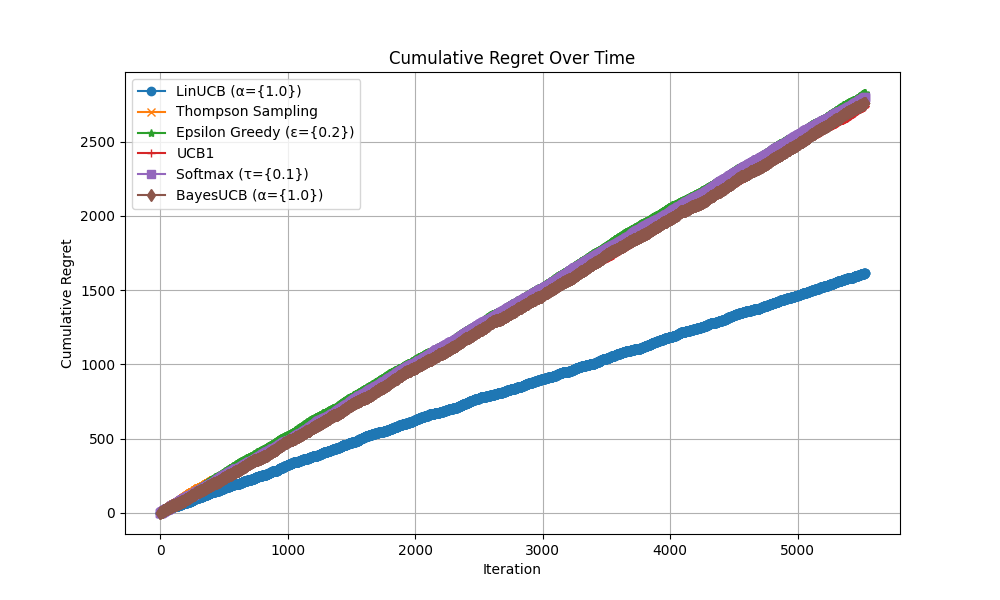
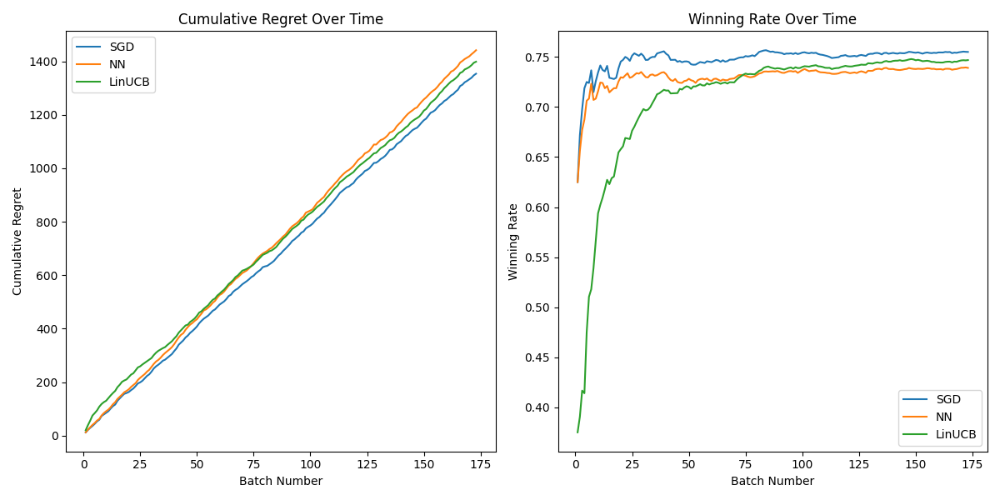

# Bandit Algorithm Performance Comparison

## Introduction

This project implements and compares various online learning algorithms for bandit problems. Among the algorithms, we specifically focus on comparing the performance of the following:

1. LinUCB
2. SGD Online Learning
3. Neural Network Online Learning

## Algorithms Implemented

### LinUCB
LinUCB is a contextual bandit algorithm that uses a linear model to estimate the expected reward for each arm. It selects arms based on the upper confidence bound, balancing exploration and exploitation.

### SGD Online Learning
The SGD (Stochastic Gradient Descent) Online Learning algorithm uses an SGD classifier to make predictions in an online learning setup. It continuously updates the model with new data to improve performance. We tuned the hyperparameters using `optuna` to minimize cumulative regret.

### Neural Network Online Learning
The Neural Network (NN) Online Learning algorithm uses a simple feedforward neural network to make predictions. The model is updated in an online learning manner, with dropout and L2 regularization to prevent overfitting. We tuned the hyperparameters using `optuna` to minimize cumulative regret.

## Data
The data used in this project is from the Spotify dataset, which includes features such as `Danceability`, `Energy`, `Key`, `Loudness`, `Mode`, `Speechiness`, `Acousticness`, `Instrumentalness`, `Liveness`, `Valence`, `Tempo`, `Duration_ms`, `Year`, `Popularity`, and `Explicit`.

## Performance Comparison

### Cumulative Regret Over Time
The following plot shows the cumulative regret over time for each algorithm. Lower cumulative regret indicates better performance. This figure implies that among conventional bandit algorithms, only LinUCB performs well. In other words, the others did not efficiently utilize the features of the data, resulting in performance equivalent to a random policy, which yields a winning rate of around 50%.



### Winning Rate Over Time
The following plot shows the winning rate over time for each algorithm. A higher winning rate indicates better performance. After tuning the hyperparameters, the SGD Classifier recorded the highest performance among them. Additionally, we can observe that although LinUCB does not perform well in the short term, as more data accumulates, it is expected to provide satisfactory performance compared to the others.



## Results
In our experiments, we observed that the LinUCB algorithm consistently outperformed both the SGD Online Learning and Neural Network Online Learning algorithms. The LinUCB algorithm had lower cumulative regret and higher winning rates over time.

### Final Winning Rates
- **LinUCB**: 0.7468
- **SGD**: 0.7550
- **Neural Network**: 0.7363

## Conclusion
Among the bandit algorithms compared, the SGD Online Learning algorithm outperformed both the LinUCB and Neural Network Online Learning algorithms. This suggests that the SGD Online Learning approach is a robust choice for contextual bandit problems, providing an effective balance between exploration and exploitation.

## How to Run
1. **Comparison of All Algorithms**:
    ```bash
    python comparison.py
    ```

## Dependencies
1. **Install required packages**:
    ```bash
    pip install -r requirements.txt
    ```

## Acknowledgements
We would like to thank the providers of the Spotify dataset for making this comparison possible.
